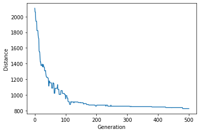
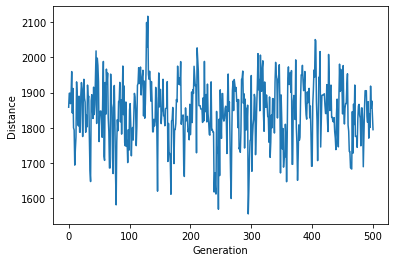
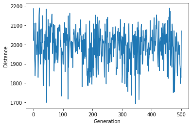
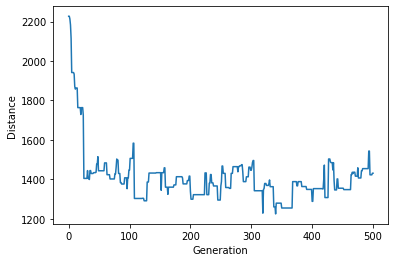
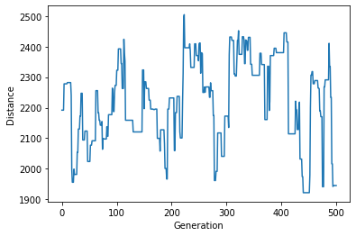
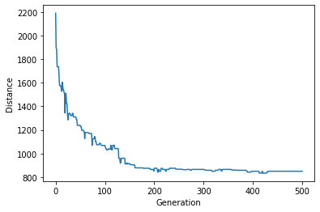
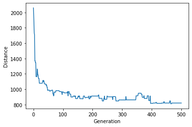
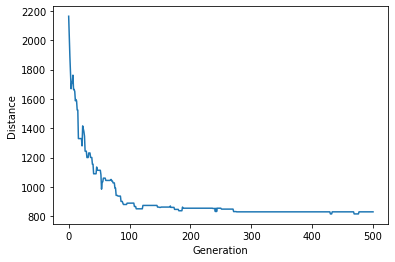
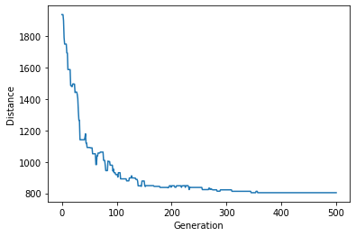

# Optimize Genetic Algorithm for Solving Traveler Salesperson Problem in Python
 
### author: Yi Rong

### date: 07/14/21

### ref: https://towardsdatascience.com/evolution-of-a-salesman-a-complete-genetic-algorithmtutorial-for-python-6fe5d2b3ca35
---

#### 1. Algorithm Results
```
geneticAlgorithm(population=cityList, popSize=100, eliteSize=20, mutationRate=0.01, generations=500)
```
Initial distance: 1992.2165065271524
Final distance: 819.7935703820748

[(11,3),
 (4,18),
 (23,94),
 (28,93),
 (48,122),
 (104,173),
 (99,180),
 (84,192),
 (5,182),
 (5,177),
 (36,173),
 (58,159),
 (56,125),
 (66,127),
 (80,113),
 (83,107),
 (93,110),
 (136,111),
 (175,100),
 (183,66),
 (183,41),
 (155,40),
 (146,23),
 (123,47),
 (53,51)]
 
#### Plot the progress
```
geneticAlgorithmPlot(population=cityList, popSize=100, eliteSize=20, mutationRate=0.01, generations=500)
```


#### 2. Mutation rate - Run the code with no mutation rate, and also mutation rate of 10% and 20%, and the rest of the parameters as default. 

#### mutation rate of 10%
```
geneticAlgorithmPlot(population=cityList, popSize=100, eliteSize=20, mutationRate=0.1, generations=500)
```


#### mutation rate of 20%
```
geneticAlgorithmPlot(population=cityList, popSize=100, eliteSize=20, mutationRate=0.2, generations=500)
```


#### 3. Population – Run the code with population 10, 50, and 100 with the rest of the parameters as default.

#### population 10
```
geneticAlgorithmPlot(population=cityList, popSize=10, eliteSize=5, mutationRate=0.01, generations=500)
```


#### population 20
```
geneticAlgorithmPlot(population=cityList, popSize=20, eliteSize=5, mutationRate=0.01, generations=500)
```


#### population 100
```
geneticAlgorithmPlot(population=cityList, popSize=100, eliteSize=5, mutationRate=0.01, generations=500)
```


#### 4.Elite size - Run the code with Elite size of 10, 20, and 40 with the rest of the parameters as default.

#### Elite size 10
```
geneticAlgorithmPlot(population=cityList, popSize=100, eliteSize=10, mutationRate=0.01, generations=500)
```


#### Elite size 20
```
geneticAlgorithmPlot(population=cityList, popSize=100, eliteSize=20, mutationRate=0.01, generations=500)
```


#### Elite size 40
```
geneticAlgorithmPlot(population=cityList, popSize=100, eliteSize=40, mutationRate=0.01, generations=500)
```


#### 5.Suggestion
I would suggest to use 10 for elite size, because it makes the convergence fastest, and use 100 as population size because it will make best convergence, and use 0.01 as mutation rate because it will make less oscillation and convergence faster. 